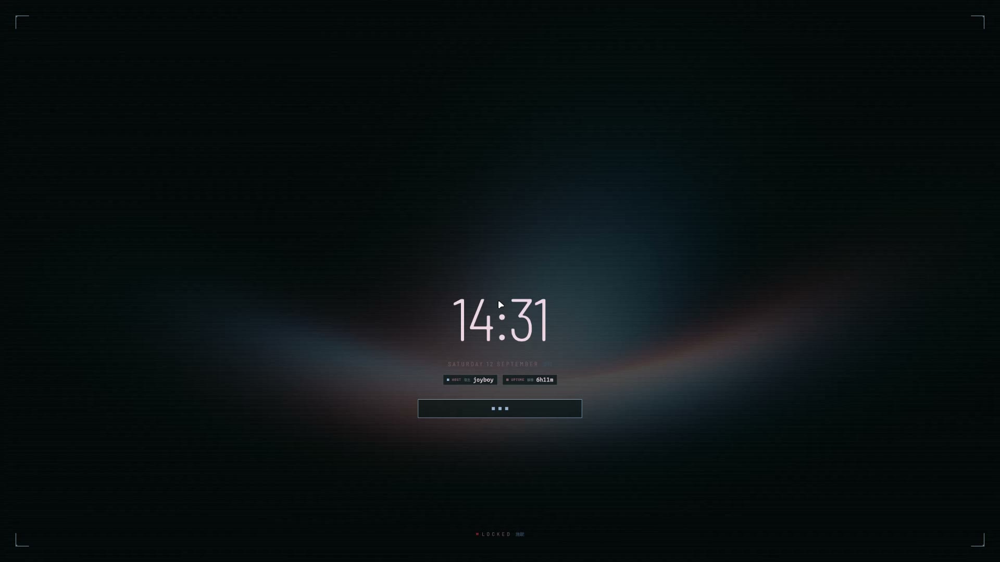
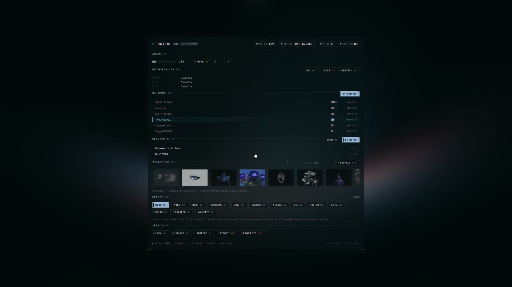
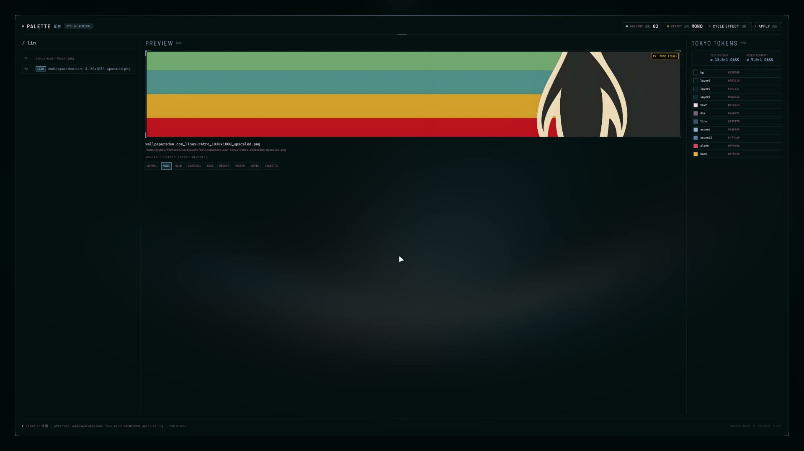

# cyberland

A Hyprland desktop built around [Quickshell](https://quickshell.org). No Waybar,
no rofi, no swaync: every surface you see is one QML shell that reads a palette
regenerated from the wallpaper.

[Watch the full showcase video](https://portfolio-five-jade-37.vercel.app/cyberland)

| | | |
|---|---|---|
|  |  |  |
| Lock screen | Control panel | Schematic vector studio |

## What is in here

| | |
|---|---|
| **Compositor** | Hyprland 0.56+, configured in **Lua** rather than hyprlang |
| **Shell** | Quickshell: frame, HUD, notifications, polkit agent, lock, idle, and a modal deck hosting 16 panels |
| **Theming** | wallust generates a palette from the wallpaper, a Python clamp step snaps it into the design system, then eight apps reload |
| **Terminal** | kitty, with ghostty configured alongside |
| **Files** | superfile |
| **Shell (dev profile)** | zsh + oh-my-zsh + starship, fzf, zoxide, lsd |
| **Editor (dev profile)** | Neovim |

## Install

Arch only. Needs `yay` or `paru`.

```sh
git clone https://github.com/tdmdh/cyberland ~/cyberland
cd ~/cyberland
./install.sh
```

It asks which profile you want:

- **desktop** installs the compositor, the shell UI and the theming pipeline.
- **full** adds zsh, Neovim and the CLI tools.

Configs are **symlinked**, so edits you make land back in the repo with no sync
step. Anything already in the way is moved to `~/.dotfiles-backup/<timestamp>/`
rather than overwritten, and re-running the script is safe.

```sh
./install.sh desktop              # non-interactive
./install.sh full --no-packages   # link only, skip pacman and fonts
./test.sh                         # run the installer against a throwaway HOME
```

## The theming pipeline

This is the part worth reading. Setting a wallpaper repaints everything:

```
wallpaper ──> swww
          └─> wallust run ──> raw palette (kmeans, 16 colors)
                          └─> hypr/bin/tokyo-palette
                              │   clamps hue into the design system's band,
                              │   because wallust has no hue filter
                              └─> hypr/wallust/tokyo.lua    (Hyprland borders)
                                  quickshell/qml_color.json (the whole UI)
                                  kitty, ghostty, superfile, cava, starship, zsh
```

`tokyo-palette` runs as a wallust hook, before the Hyprland reload, so nothing
ever reads a half-updated palette. Every consumer has a hardcoded fallback, so
a missing palette file degrades to the shipped default instead of breaking.

## Layout

```
config/          symlinked into ~/.config/
  hypr/
    hyprland.lua     entry point
    conf/            monitors, look and feel, animations, input, binds, rules, autostart
    theme.lua        every tweakable value: fonts, gaps, colors, apps
    bin/             sysbus, sensorprobe, portprobe, devprobe telemetry daemons
  quickshell/
    common/          Theme singleton and shared components
    deck/views/      the 16 modal panels
    frame/ hud/ notify/ auth/ lock/ idle/
  wallust/       palette templates
home/.zshrc      symlinked into ~/
share/           schematic engine source, built into ~/.local/share on install
```

## Keys

`Super + /` opens the full cheatsheet. The ones worth knowing first:

| | |
|---|---|
| `Super + Space` | wheel launcher |
| `Super + W` | wallpaper and theme studio |
| `Super + C` | control panel |
| `Super + Return` | terminal |
| `Super + X` | schematic vector studio |
| `Super + O` | workspace expose |

The layout is **scrolling**, not dwindle: windows live in columns you pan
across rather than a tree you subdivide.

## Multi-monitor

`conf/monitors.lua` ships a catch-all only, and it asks for the panel's
`preferred` mode rather than `highres`. Plenty of 1440p monitors advertise a
downscaled 4K mode over HDMI, and taking it at scale 1 makes everything
microscopic. Your own layout goes in
`conf/monitors_local.lua`, which git ignores so a display arrangement never
travels with the repo. The installer seeds it from the `.example`.

```sh
hyprctl monitors          # find your outputs
$EDITOR ~/.config/hypr/conf/monitors_local.lua
hyprctl reload
```

## Notes

- The palette files under `config/hypr/wallust/` and `config/quickshell/qml_color.json`
  are generated. They are committed as defaults so a fresh install looks right
  before you set a wallpaper, which means they will show as modified after every
  wallpaper change. Commit them or check them out, either is fine.
- `bin/devprobe` scans `~/codebase` for projects. Point `DEV_ROOT` elsewhere if
  your projects live somewhere else.
- The schematic studio needs [bun](https://bun.sh). Everything else works without it.
